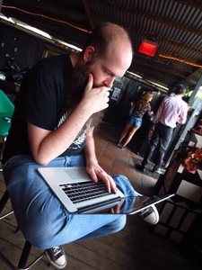

<figure>

</figure>

This is pretty much what I do &mdash; I stare at things, and think real hard, and usually something
useful happens.

I'm a coder by training. I've worked in a lot of industries, some interesting, some not. I fiddle
about in a lot of other areas &mdash; I'm a bit of a mad scientist. I'm interested in electronics,
vintage computing, 3D printing and CNC, music, photography, gaming, cosplay, and a little bit of
everything.

I use this blog to talk about things I'm working on. Hopefully some of it will be of interest.
